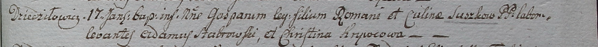

**Сушко Гаспар Романов (Suszko Gaspar)**

17 января 1799 г -- крещение (НИАБ 1781-27-199, лист 125, №7/1799-б).

**НИАБ 1781-27-199:** Лист 125. **Метрическая запись №7/1799-р.**

Дедиловичский костел Наисвятейшего Сердца Иисуса. 17 января 1799 года.
Метрическая запись о крещении.

Suszko Gaspar -- сын крестьян с деревни Дедиловичи.

Suszko Roman -- отец.

Suszkowa Culina -- мать.

Stabrowski Adam -- крестный отец.

Krywcowa Christina - крестная мать.

Linhart Hyacinthus -- ксёндз.
