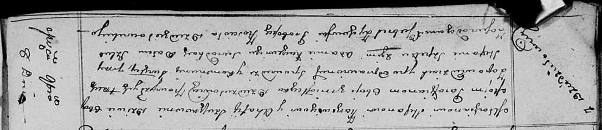

**Каржевич (в девичестве Сушко) Агафия (Karżewiczowa Ahafia z Suszkow)**

8 ноября 1811 г -- венчание с молодым Стефаном Каржевичем с деревни
Дедиловичи (НИАБ 136-13-920, лист 17об, №9/1811-б (ориг)).

**НИАБ 136-13-920:** Лист 17об. **Метрическая запись №9/1811-б (ориг).**

Осовская Покровская церковь. 8 ноября 1811 года. Метрическая запись о
венчании.

Karzewicz Stefan -- жених, молодой, парафии Осовской, местечко
Дедиловичи.

Szuszkowna Ahafia -- невеста, девка, парафии осовской, местечко
Дедиловичи.

Szpet Stefan -- свидетель.

Karzewicz Adam -- свидетель.

Zychowski Gabryel -- ксёндз костёла Дедиловичского.
