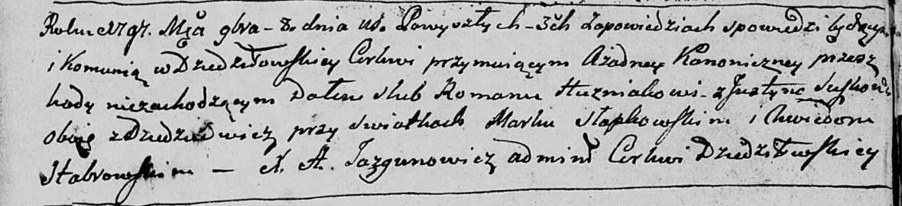

**Сушко Аксиня (Suszkowa Axinia)**

10 февраля 1802 г -- крестная мать Барбары, дочери Тодора и Татьяны
Кушнеревичей с деревни Дедиловичи (НИАБ 937-4-32, лист 6, №4/1802-р).

10 июля 1804 г -- крестная мать Анастасии, дочери Тодора и Анастасии
Каржевичей с деревни Дедиловичи (НИАБ 937-4-32, лист 10об, №18/1804-р).

**НИАБ 937-4-32:** Лист 6. **Метрическая запись №4/1802-р.**

{width="6.496527777777778in"
height="0.9666666666666667in"}

Дедиловичский костел Наисвятейшего Сердца Иисуса. 10 февраля 1802 года.
Метрическая запись о крещении.

Kusznierewiczowna Barbara -- дочь крестьян с деревни Дедиловичи.

Kusznierewicz Theodor -- отец.

Kusznierewiczowa Tacyana -- мать.

Sawicki Paul -- крестный отец, с деревни Дедиловичи.

Suszkowa Axinia -- крестная мать, с деревни Дедиловичи.

Linhart Hyacinthus -- ксёндз.

**НИАБ 937-4-32:** Лист 10об. **Метрическая запись №18/1804-р.**

{width="6.496527777777778in"
height="0.7180555555555556in"}

Дедиловичский костел Наисвятейшего Сердца Иисуса. 10 июля 1804 года.
Метрическая запись о крещении.

Karzewiczowna Anastasia -- дочь родителей с деревни Дедиловичи.

Karzewicz Teodor -- отец.

Karzewiczowa Anastasia -- мать.

Sawicki Paul -- крестный отец.

Suszkowa Axinia -- крестная мать, с деревни Дедиловичи.

Galinowski Joann -- ксёндз, комендант Дедиловичского костела.
