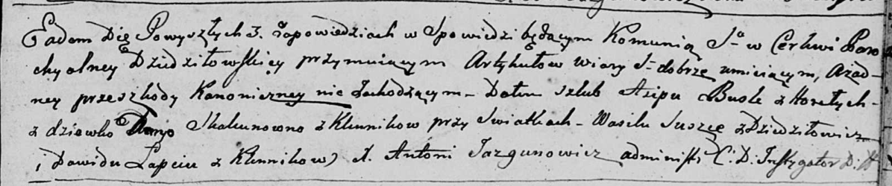

**Сушко Василь (Suszko Wasil)**

11 января 1797 г -- свидетель венчания Асипа Бусла с деревни Горелое с
девкой Дарьей Скакун с деревни Клинники (НИАБ 136-13-920, лист 4,
№2/1797-б (ориг)).

**НИАБ 136-13-920:** Лист 4. **Метрическая запись №2/1797-б (ориг).**

Дедиловичская Покровская церковь. 11 января 1797 года. Метрическая
запись о венчании.

Busła Asip -- жених, с деревни Горелое.

Skakunowna Daryja -- невеста, девка с деревни Клинники.

Suszko Wasil -- свидетель, с деревни Дедиловичи.

Łapiec Dawid -- свидетель, с деревни Клинники.

Jazgunowicz Antoni -- ксёндз.
