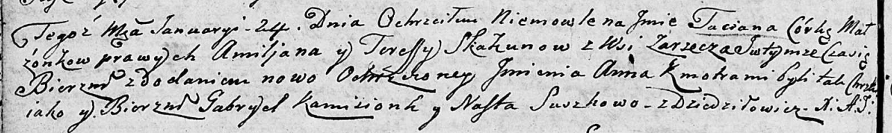

**Сушко Наста (Suszkowa Nasta)**

24 января 1805 г -- крестная мать Татьяны Анны, дочери Скакунов Емильяна
и Тересы с деревни Заречье (НИАБ 136-13-894, лист 56об, №13/1805-р
(ориг)).

**НИАБ 136-13-894:** Лист 56об. **Метрическая запись №13/1805-р
(ориг).**

Дедиловичская Покровская церковь. 24 января 1805 года. Метрическая
запись о крещении.

Skakunowna Taciana Anna -- дочь родителей с деревни Заречье.

Skakun Amiljan -- отец.

Skakunowa Teresa -- мать.

Kamizionek Gabriel -- кум.

Suszkowa Nasta -- кума, с деревни Дедиловичи.

Jazgunowicz Antoni -- ксёндз.
