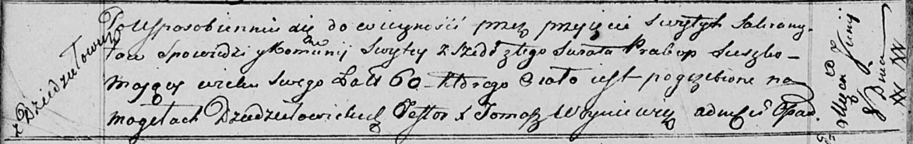

**Сушко Пракоп (Suszko Prakop)**

8 июня 1817 г -- отпевание, умер в возрасте 60 дет (родился около 1757
г) (НИАБ 136-13-919, лист 30об, №12/1817-у (ориг)).

**НИАБ 136-13-919:** Лист 30об. **Метрическая запись №12/1817-у
(ориг).**

Осовская униатская церковь. 8 июня 1817 года. Метрическая запись об
отпевании.

Suszko Prakop -- умерший, 60 лет, с деревни Дедиловичи, похоронен на
кладбище деревни Осово.

Woyniewicz Tomasz -- ксёндз.
