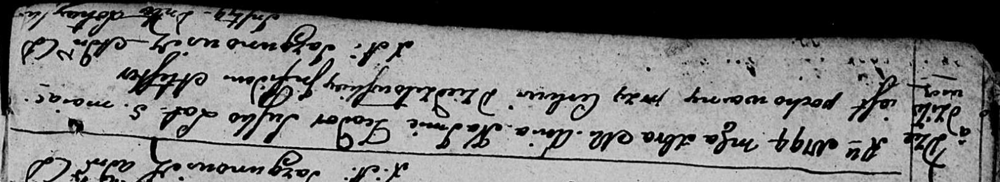

**Сушко Тодор (Suszko Teodor)**

12 декабря 1794 г -- отпевание, умер в возрасте 5 дет (родился около
1789 г) (НИАБ 136-13-919, лист 3об, №66/1794-у (ориг)).

**НИАБ 136-13-919:** Лист 3об. **Метрическая запись №66/1794-у (ориг).**

Дедиловичская Покровская церковь. 12 декабря 1794 года. Метрическая
запись об отпевании.

Suszko Teodor -- умерший, 5 лет, с деревни Дедиловичи, похоронен на
кладбище при церкви Дедиловичской.

Jazgunowicz Antoni -- ксёндз.
