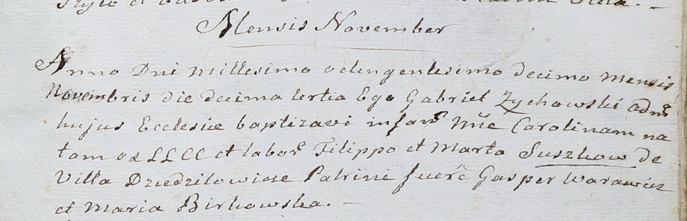

**Сушко Марта (Suszkowa Marta)**

13 ноября 1810 г -- крещение дочери Каролины (НИАБ 937-4-32, лист 22,
№17/1810-р).

**НИАБ 937-4-32:** Лист 22. **Метрическая запись №17/1810-р.**

Дедиловичский костел Наисвятейшего Сердца Иисуса. 13 ноября 1810 года.
Метрическая запись о крещении.

Suszkowna Carolina -- дочь крестьян с деревни Дедиловичи.

Suszko Filipp -- отец.

Suszkowa Marta -- мать.

Warawicz Gasperi -- крестный отец.

Birkowska Maria -- крестная мать.

Zychowski Gabriel -- ксёндз.
