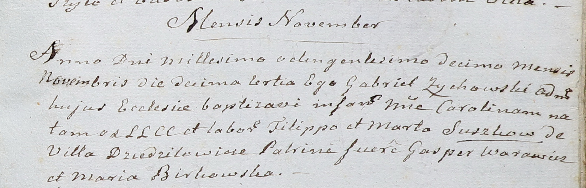

**Сушко Филип (Suszko Filip)**

10 февраля 1807 г -- свидетель венчания Стрельчёнка Самуся с деревни
Маковье с Марьяной Тарасевич с деревни Заречье (НИАБ 136-13-920, лист
12, №2/1807-б (ориг)).

13 ноября 1810 г -- крещение дочери Каролины (НИАБ 937-4-32, лист 22,
№17/1810-р).

**НИАБ 136-13-920:** Лист 12. **Метрическая запись №2/1807-б (ориг).**

{width="6.496527777777778in"
height="1.6078718285214348in"}

Дедиловичская Покровская церковь. 10 февраля 1807 года. Метрическая
запись о венчании.

Stralczonek Samuś -- жених, с деревни Маковье.

Tarasewiczowna Marjana -- невеста, с деревни Заречье.

Kuryan Klamiata -- свидетель, с деревни Маковье.

Suszko Filip -- свидетель, с деревни Дедиловичи.

Jazgunowicz Antoni -- ксёндз.

**НИАБ 937-4-32:** Лист 22. **Метрическая запись №17/1810-р.**

{width="6.496527777777778in"
height="2.095833333333333in"}

Дедиловичский костел Наисвятейшего Сердца Иисуса. 13 ноября 1810 года.
Метрическая запись о крещении.

Suszkowna Carolina -- дочь крестьян с деревни Дедиловичи.

Suszko Filipp -- отец.

Suszkowa Marta -- мать.

Warawicz Gasperi -- крестный отец.

Birkowska Maria -- крестная мать.

Zychowski Gabriel -- ксёндз.
