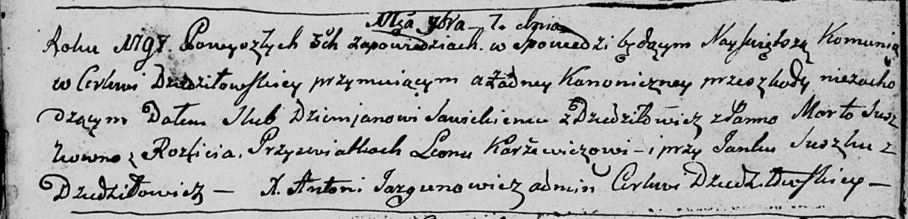

**Сушко Настасья Янкова (Suszkowna Nastazya Barbara)**

30 января 1810 г -- крещение дочери Настасьи Варвары (НИАБ 136-13-894,
лист 76об, №5/1810-р (ориг)).

**НИАБ 136-13-894:** Лист 76об. **Метрическая запись №5/1810-р (ориг).**

{width="6.496527777777778in"
height="1.3892869641294838in"}

Дедиловичская Покровская церковь. 30 января 1810 года. Метрическая
запись о крещении.

Suszkowna Nastazya Barbara -- дочь родителей из деревни Дедиловичи.

Suszko Janka -- отец.

Suszkowa Hrypina -- мать.

Kaminski Hryhor -- кум.

Randakowa Zosia -- кума.

Jazgunowicz Antoni -- ксёндз.
