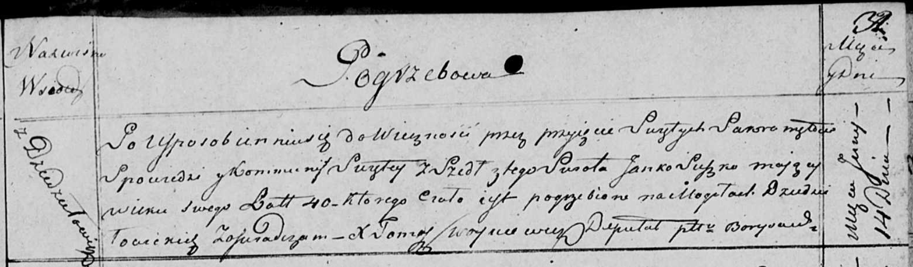

**Сушко Янка (Suszko Janka, Janko)**

7 ноября 1797 г -- свидетель венчания Демьяна Савицкого с деревни
Дедиловичи с Мартой Сушко с деревни Разлитье (НИАБ 136-13-920, лист 4об,
№8/1797-б (коп)).

30 января 1810 г -- крещение дочери Настасьи Варвары (НИАБ 136-13-894,
лист 76об, №5/1810-р (ориг)).

14 июня 1818 г -- отпевание, умер в возрасте 40 лет (родился около 1778
г) (НИАБ 136-13-919, лист 32, №10/1818-у (ориг)).

**НИАБ 136-13-920:** Лист 4об. **Метрическая запись №8/1797-б (ориг).**

{width="6.496527777777778in"
height="1.572334864391951in"}

Дедиловичская Покровская церковь. 7 ноября 1797 года. Метрическая запись
о венчании.

Sawicki Dziemjan -- жених, с деревни Дедиловичи.

Suszkowna Marta -- невеста, с деревни Разлитье.

Karżewicz Leon -- свидетель.

Suszko Janka -- свидетель, с деревни Дедиловичи.

Jazgunowicz Antoni -- ксёндз.

**НИАБ 136-13-894:** Лист 76об. **Метрическая запись №5/1810-р (ориг).**

{width="6.496527777777778in"
height="1.3892869641294838in"}

Дедиловичская Покровская церковь. 30 января 1810 года. Метрическая
запись о крещении.

Suszkowna Nastazya Barbara -- дочь родителей из деревни Дедиловичи.

Suszko Janka -- отец.

Suszkowa Hrypina -- мать.

Kaminski Hryhor -- кум.

Randakowa Zosia -- кума.

Jazgunowicz Antoni -- ксёндз.

**НИАБ 136-13-919:** Лист 32. **Метрическая запись №10/1818-у (ориг).**

{width="6.496527777777778in"
height="1.90625in"}

Осовская униатская церковь. 14 июня 1818 года. Метрическая запись об
отпевании.

Suszko Janko -- умерший, 40 лет, с деревни Дедиловичи, похоронен на
кладбище деревни Дедиловичи.

Woyniewicz Tomasz -- ксёндз.
