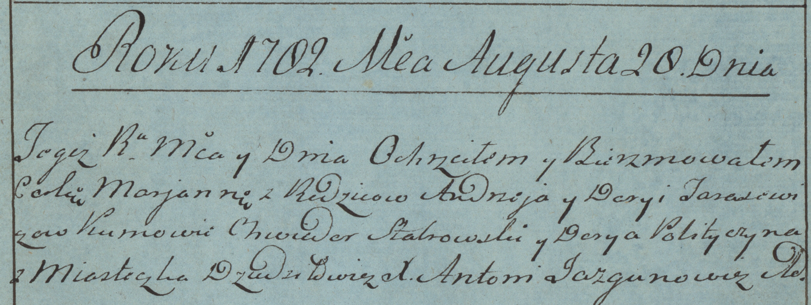

**Тарасевич Марьяна Андреева (Tarasewiczowna Marjanna)**

20 августа 1782г -- крещение (РГИА 823-2-18, лист 222, №1/1782-р (коп)).

**РГИА 823-2-18:** Лист 222. **Метрическая запись №1/1782-р (коп).**

Дедиловичская униатская церковь. 20 августа 1782 года. Метрическая
запись о крещении.

Tarasewiczowna Marjanna -- дочь родителей с местечка Дедиловичи.

Tarasewicz Andrzey -- отец.

Tarasewiczowa Darya -- мать.

Stabrowski Chwiedor -- кум.

Polityczyna Darya - кума.

Jazgunowicz Antoni -- ксёндз.
