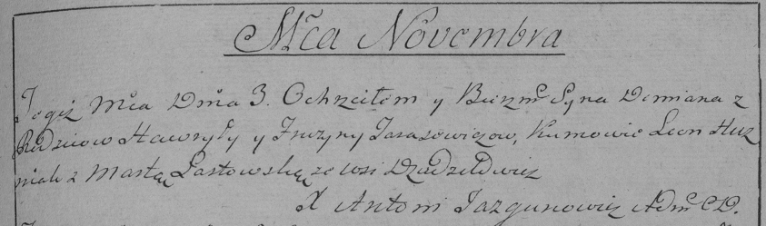

**Тарасевич Демьян Гаврылов (Tarasewicz Demjan)**

3 ноября 1790 г -- крещение сына Демьяна (НИАБ 136-13-894, лист 11об,
№78/1790-р (ориг)), (РГИА 823-2-18, лист 241, №29/1790-р (коп)).

**НИАБ 136-13-894:** Лист 11об. **Метрическая запись №78/1790-р
(ориг).**

{width="6.496527777777778in"
height="0.9514468503937008in"}

Дедиловичская Покровская церковь. 3 ноября 1790 года. Метрическая запись
о крещении.

Tarasewicz Demjan -- сын родителей с деревни Дедиловичи.

Tarasewicz Hawryła -- отец.

Tarasewiczowa Fruzyna -- мать.

Huzniak Leon - кум.

Łastowska Marta - кума.

Jazgunowicz Antoni -- ксёндз.

**РГИА 823-2-18:** Лист 241. **Метрическая запись №29/1790-р (коп).**

{width="6.496527777777778in"
height="1.91875in"}

Дедиловичская Покровская церковь. 3 ноября 1790 года. Метрическая запись
о крещении.

Tarasewicz Demian -- сын родителей с деревни Дедиловичи.

Tarasewicz Hawryła -- отец.

Tarasewiczowa Fruzyna -- мать.

Huzniak Leon -- кум.

Łastowska Marta - кума.

Jazgunowicz Antoni -- ксёндз.
