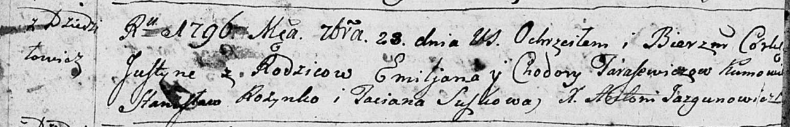
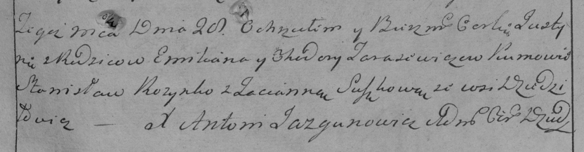
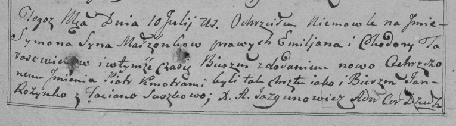
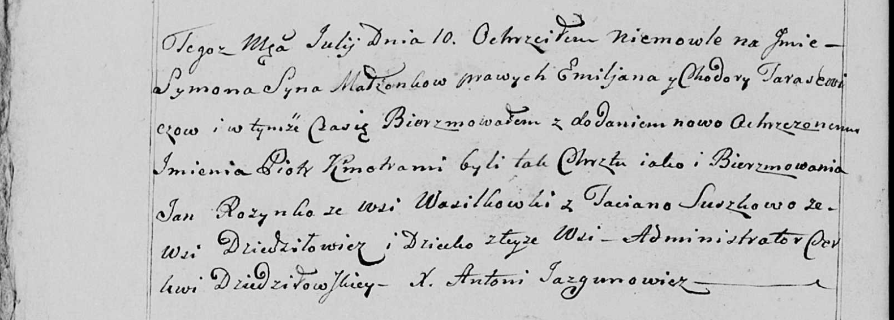

**Тарасевич Емельян (Tarasewicz Emiljan)**

28 сентября 1796 г -- крещение дочери Юстыны (НИАБ 136-13-894, лист
30об, №83/1796-р (ориг)), (РГИА 823-2-18, лист 257, №48/1796-р (коп)).

10 июля 1800 г -- крещение сына Сымона Петра (НИАБ 136-13-894, лист
41об, №17/1800-р (ориг), РГИА 823-2-18, лист 276, №16/1800-р (коп), НИАБ
136-13-949, лист 102об, №18/1800-р (коп)).

**НИАБ 136-13-894:** Лист 30-об. **Метрическая запись №83/1796-р
(ориг).**

Дедиловичская Покровская церковь. 28 сентября 1796 года. Метрическая
запись о крещении.

Tarasewiczowna Justyna -- дочь родителей с деревни Дедиловичи.

Tarasewicz Emiljan -- отец.

Tarasewiczowa Chodora -- мать.

Rozynko Stanisław -- кум.

Suszkowa Taciana - кума.

Jazgunowicz Antoni -- ксёндз.

**РГИА 823-2-18:** Лист 257. **Метрическая запись №48/1796-р (коп).**

Дедиловичская Покровская церковь. 28 сентября 1796 года. Метрическая
запись о крещении.

Tarasewiczowna Justynia -- дочь родителей с деревни Дедиловичи.

Tarasewicz Emilian -- отец.

Tarasewiczowa Chodora -- мать.

Rozynko Stanisław -- кум.

Suszkowa Tacianna -- кума.

Jazgunowicz Antoni -- ксёндз.

**НИАБ 136-13-894:** Лист 41об. **Метрическая запись №17/1800-р
(ориг).**

Дедиловичская Покровская церковь. 10 июля 1800 года. Метрическая запись
о крещении.

Tarasewicz Symon Piotr -- сын родителей с деревни Дедиловичи.

Tarasewicz Emiljan -- отец.

Tarasewiczowa Chodora -- мать.

Rozynka Jan -- кум.

Suszkowa Taciana -- кума.

Jazgunowicz Antoni -- ксёндз.

**РГИА 823-2-18:** Лист 276. **Метрическая запись №16/1800-р (коп).**

Дедиловичская Покровская церковь. 10 июля 1800 года. Метрическая запись
о крещении.

Tarasewicz Symon Piotr -- сын родителей с деревни \[Дедиловичи\].

Tarasewicz Emiljan -- отец.

Tarasewiczowa Chodora -- мать.

Rozynko Jan -- кум.

Suszkowa Taciana -- кума.

Jazgunowicz Antoni -- ксёндз.

**НИАБ 136-13-949:** Лист 102об. **Метрическая запись №18/1800-р
(коп).**

(См. тж.: РГИА 823-2-18, лист 276, №16/1800-р (коп), НИАБ 136-13-894,
лист 41об, №17/1800-р (ориг))

Дедиловичская Покровская церковь. 10 июля 1800 года. Метрическая запись
о крещении.

Tarasewicz Symon Piotr -- сын родителей с деревни Дедиловичи.

Tarasewicz Emiljan -- отец.

Tarasewiczowa Chodora -- мать.

Rozynko Jan -- кум, с деревни Васильковка.

Suszkowa Taciana - кума, с деревни Дедиловичи.

Jazgunowicz Antoni -- ксёндз.
