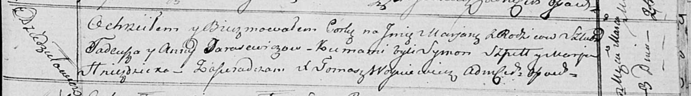

**Тарасевич Тадей (Tarasewicz Tadeusz)**

3 марта 1818 г -- крещение дочери Марьяны (НИАБ 136-13-894, лист 98,
№8/1818-р (ориг)).

**НИАБ 136-13-894:** Лист 98. **Метрическая запись №8/1818-р (ориг).**

Осовская Покровская церковь. 3 марта 1818 года. Метрическая запись о
крещении.

Tarasewiczowna Marjana -- дочь родителей с деревни Дедиловичи.

Tarasewicz Tadeusz -- отец.

Tarasewiczowa Anna -- мать.

Szpet Symon -- кум.

Hniezdzicka Marja -- кума.

Woyniewicz Tomasz -- ксёндз.
