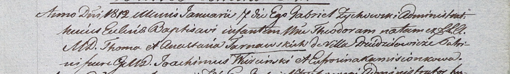

**Тарновская Анастасия (Tarnowska Annastazia, Anastasia)**

24 октября 1807 г -- крестная мать Розалии, дочери Космы и Евы Беляков с
деревни Мрай (НИАБ 937-4-32, лист 16об, №21/1807-р).

24 апреля 1810 г -- крещение дочери Катарины (НИАБ 937-4-32, лист 21об,
№13/1810-р).

6 декабря 1810 г -- крестная мать Бонифация, сына Игната и Христины
Слёзок с деревни Дедиловичи (НИАБ 937-4-32, лист 22об, №20/1810-р).

7 января 1812 г -- крещение дочери Теодоры (НИАБ 937-4-32, лист 24,
№1/1812-р).

**НИАБ 937-4-32:** Лист 16об. **Метрическая запись №21/1807-р.**

Дедиловичский костел Наисвятейшего Сердца Иисуса. 24 октября 1807 года.
Метрическая запись о крещении.

Bielakowna Rosalia -- дочь крестьян с деревни Мрай.

Bielak Cosma -- отец.

Bielakowa Ewa -- мать.

Szabłowski Georgius -- крестный отец.

Tarnowska Annastazia -- крестная мать, с деревни Дедиловичи.

Scindzelewski Andreas -- ксёндз, викарий Дедиловичский.

**НИАБ 937-4-32:** Лист 21об. **Метрическая запись №13/1810-р.**

Дедиловичский костел Наисвятейшего Сердца Иисуса. 24 апреля 1810 года.
Метрическая запись о крещении.

Tarnowska Catharina -- дочь шляхтичей со двора Дедиловичи.

Tarnowski Thoma -- отец.

Tarnowska Anastasia -- мать.

Wiercinski Joachim -- крестный отец, шляхтич.

Komisionkowa Eufrosina -- крестная мать.

Zychowski Gabriel -- ксёндз.

**НИАБ 136-13-920:** Лист 22об. **Метрическая запись №20/1810-р.**

Дедиловичский костел Наисвятейшего Сердца Иисуса. 6 декабря 1810 года.
Метрическая запись о крещении.

Słoska Bonifaci -- сын крестьян с деревни Дедиловичи.

Słoska Jgnat -- отец.

Słoskowa Christina -- мать.

Słabkowski Paul -- крестный отец.

Tarnowska Anastasia -- крестная мать, с деревни Дедиловичи.

Zychowski Gabriel -- ксёндз.

**НИАБ 937-4-32:** Лист 24. **Метрическая запись №1/1812-р.**

Дедиловичский костел Наисвятейшего Сердца Иисуса. 7 января 1812 года.
Метрическая запись о крещении.

Tarnowska Theodora -- дочь шляхтичей с деревни Дедиловичи.

Tarnowski Thoma -- отец.

Tarnowska Anastasia -- мать.

Wiercinski Joachim -- крестный отец, шляхтич.

Kamisionkowa Eufrosina -- крестная мать.

Zychowski Gabriel -- ксёндз.
