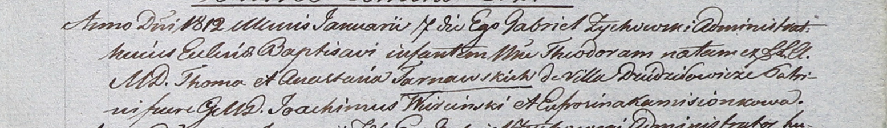

**Тарновский Томаш (Tarnowski Thoma)**

24 апреля 1810 г -- крещение дочери Катарины (НИАБ 937-4-32, лист 21об,
№13/1810-р).

7 января 1812 г -- крещение дочери Теодоры (НИАБ 937-4-32, лист 24,
№1/1812-р).

**НИАБ 937-4-32:** Лист 21об. **Метрическая запись №13/1810-р.**

{width="6.496527777777778in"
height="1.8791666666666667in"}

Дедиловичский костел Наисвятейшего Сердца Иисуса. 24 апреля 1810 года.
Метрическая запись о крещении.

Tarnowska Catharina -- дочь шляхтичей со двора Дедиловичи.

Tarnowski Thoma -- отец.

Tarnowska Anastasia -- мать.

Wiercinski Joachim -- крестный отец, шляхтич.

Komisionkowa Eufrosina -- крестная мать.

Zychowski Gabriel -- ксёндз.

**НИАБ 937-4-32:** Лист 24. **Метрическая запись №1/1812-р.**

{width="6.496527777777778in"
height="0.9444444444444444in"}

Дедиловичский костел Наисвятейшего Сердца Иисуса. 7 января 1812 года.
Метрическая запись о крещении.

Tarnowska Theodora -- дочь шляхтичей с деревни Дедиловичи.

Tarnowski Thoma -- отец.

Tarnowska Anastasia -- мать.

Wiercinski Joachim -- крестный отец, шляхтич.

Kamisionkowa Eufrosina -- крестная мать.

Zychowski Gabriel -- ксёндз.
