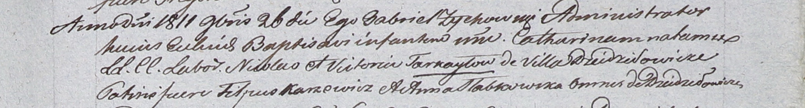

**Торкайло Виктория (Torkayłowa Victoria)**

26 ноября 1811 г -- крещение дочери Катарины (НИАБ 937-4-32, лист 24,
№21/1811-р).

**НИАБ 937-4-32:** Лист 24. **Метрическая запись №21/1811-р.**

{width="6.496527777777778in"
height="0.8798611111111111in"}

Дедиловичский костел Наисвятейшего Сердца Иисуса. 26 ноября 1811 года.
Метрическая запись о крещении.

Tarkayłowna Catharina -- дочь крестьян с деревни Дедиловичи.

Tarkayło Nicołay -- отец.

Tarkayłowa Victoria -- мать.

Karzewicz Filipus -- крестный отец, с деревни Дедиловичи.

Słabkowska Anna -- крестная мать, с деревни Дедиловичи.

Zychowski Gabriel -- ксёндз.
