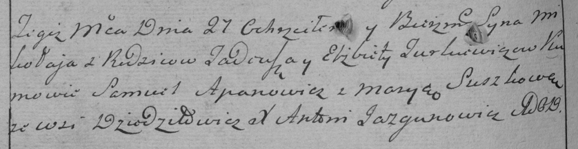
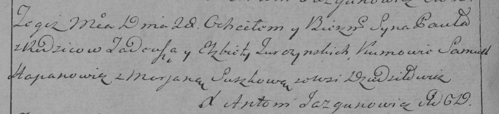
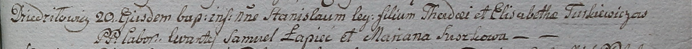

**Туркевич Елисавета (Turkiewiczowa, Turczynska Elżbieta, Elisabetha)**

27 декабря 1786 г -- крещение сына Миколая (РГИА 823-2-18, лист 232об,
№30/1786-р (коп)).

8 февраля 1792 г -- крещение сына Яна (НИАБ 136-13-894, лист 15,
№6/1792-р (ориг)), (РГИА 823-2-18, лист 243об, №2/1792-р (коп)).

28 октября 1795 г -- крещение сына Павла (НИАБ 136-13-894, лист 26,
№47/1795-р (ориг)), (РГИА 823-2-18, лист 253об, №35/1795-р (коп)).

20 января 1799 г -- крещение сына Станислава (НИАБ 1781-27-199, лист
125, №8/1799-р).

**РГИА 823-2-18:** Лист 232об. **Метрическая запись №30/1786-р (коп).**

Дедиловичская Покровская церковь. 27 декабря 1786 года. Метрическая
запись о крещении.

Turkiewicz Mikołay -- сын родителей с деревни Дедиловичи.

Turkiewicz Tadeusz -- отец.

Turkiewiczowa Elżbieta -- мать.

Apanowicz Samuel -- кум.

Suszkowa Marya - кума.

Jazgunowicz Antoni -- ксёндз.

**НИАБ 136-13-894:** Лист 15. **Метрическая запись №6/1792-р (ориг).**

Дедиловичская Покровская церковь. 8 февраля 1792 года. Метрическая
запись о крещении.

Turkiewicz Jan -- дочь родителей с деревни Дедиловичи.

Turkiewicz Thadeusz -- отец.

Turkiewiczowa Elżbieta -- мать.

Hapanowicz Samuś -- кум.

Suszkowa Maryia - кума.

Jazgunowicz Antoni -- ксёндз.

**РГИА 823-2-18:** Лист 243об. **Метрическая запись №2/1792-р (коп).**

Дедиловичская Покровская церковь. 8 января 1792 года. Метрическая запись
о крещении.

Turkiewicz Jan -- сын родителей с деревни Дедиловичи.

Turkiewicz Tadeusz -- отец.

Turkiewiczowa Elżbieta -- мать.

Hapanowicz Samus -- кум.

Suszkowa Marya - кума.

Jazgunowicz Antoni -- ксёндз.

Лист 26. **Метрическая запись №47/1795-р (ориг).**

Дедиловичская Покровская церковь. 28 октября 1795 года. Метрическая
запись о крещении.

Turczynski Paweł -- сын родителей с деревни Дедиловичи.

Turczynski Thadeusz -- отец.

Turczynska Elżbieta -- мать.

Hapanowicz Samuel - кум.

Suszkowna Marjana - кума.

Jazgunowicz Antoni -- ксёндз.

**РГИА 823-2-18:** Лист 253об. **Метрическая запись №35/1795-р (коп).**

Дедиловичская Покровская церковь. 28 октября 1795 года. Метрическая
запись о крещении.

Turczynowicz Paweł -- сын родителей с деревни Дедиловичи.

Turczynowicz Tadeusz -- отец.

Turczynowiczowa Elżbieta -- мать.

Hapanowicz Samuel -- кум.

Suszkowa Marjana -- кума.

Jazgunowicz Antoni -- ксёндз.

**НИАБ 1781-27-199:** Лист 125. **Метрическая запись №8/1799-р.**

Дедиловичский костел Наисвятейшего Сердца Иисуса. 20 января 1799 года.
Метрическая запись о крещении.

Turkiewicz Stanisław -- сын крестьян с деревни Дедиловичи.

Turkiewicz Thadei -- отец.

Turkiewiczowa Elisabetha -- мать.

Łapiec Samuel -- крестный отец.

Suszkowa Mariana - крестная мать.

Linhart Hyacinthus -- ксёндз.
