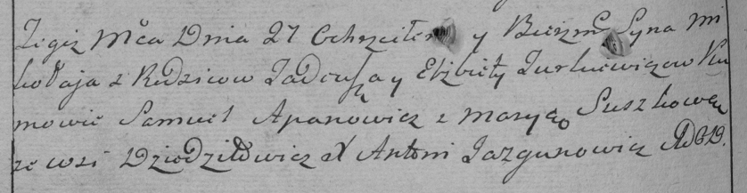

**Туркевич Миколай Тадеев (Turkiewicz Mikołay)**

27 декабря 1786 г -- крещение (РГИА 823-2-18, лист 232об, №30/1786-р
(коп)).

**РГИА 823-2-18:** Лист 232об. **Метрическая запись №30/1786-р (коп).**

{width="6.496527777777778in"
height="1.6819444444444445in"}

Дедиловичская Покровская церковь. 27 декабря 1786 года. Метрическая
запись о крещении.

Turkiewicz Mikołay -- сын родителей с деревни Дедиловичи.

Turkiewicz Tadeusz -- отец.

Turkiewiczowa Elżbieta -- мать.

Apanowicz Samuel -- кум.

Suszkowa Marya - кума.

Jazgunowicz Antoni -- ксёндз.
