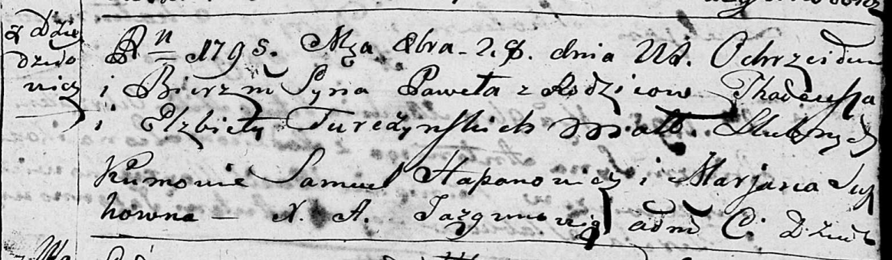
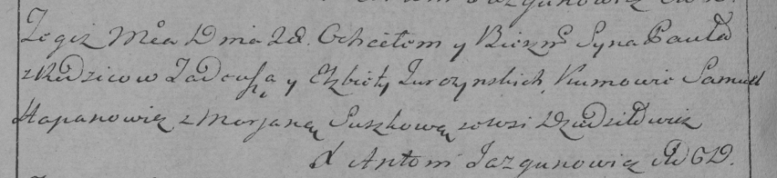

**Туркевич Павел Тадеев (Turczynski Paweł)**

28 октября 1795 г -- крещение (НИАБ 136-13-894, лист 26, №47/1795-р
(ориг)), (РГИА 823-2-18, лист 253об, №35/1795-р (коп)).

Лист 26. **Метрическая запись №47/1795-р (ориг).**

Дедиловичская Покровская церковь. 28 октября 1795 года. Метрическая
запись о крещении.

Turczynski Paweł -- сын родителей с деревни Дедиловичи.

Turczynski Thadeusz -- отец.

Turczynska Elżbieta -- мать.

Hapanowicz Samuel - кум.

Suszkowna Marjana - кума.

Jazgunowicz Antoni -- ксёндз.

**РГИА 823-2-18:** Лист 253об. **Метрическая запись №35/1795-р (коп).**

Дедиловичская Покровская церковь. 28 октября 1795 года. Метрическая
запись о крещении.

Turczynowicz Paweł -- сын родителей с деревни Дедиловичи.

Turczynowicz Tadeusz -- отец.

Turczynowiczowa Elżbieta -- мать.

Hapanowicz Samuel -- кум.

Suszkowa Marjana -- кума.

Jazgunowicz Antoni -- ксёндз.
