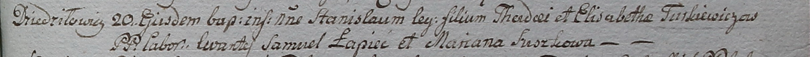

**Туркевич Станислав Тадеев (Turkiewicz Stanisław)**

20 января 1799 г -- крещение (НИАБ 1781-27-199, лист 125, №8/1799-р).

**НИАБ 1781-27-199:** Лист 125. **Метрическая запись №8/1799-р.**

{width="6.496527777777778in"
height="0.4618055555555556in"}

Дедиловичский костел Наисвятейшего Сердца Иисуса. 20 января 1799 года.
Метрическая запись о крещении.

Turkiewicz Stanisław -- сын крестьян с деревни Дедиловичи.

Turkiewicz Thadei -- отец.

Turkiewiczowa Elisabetha -- мать.

Łapiec Samuel -- крестный отец.

Suszkowa Mariana - крестная мать.

Linhart Hyacinthus -- ксёндз.
