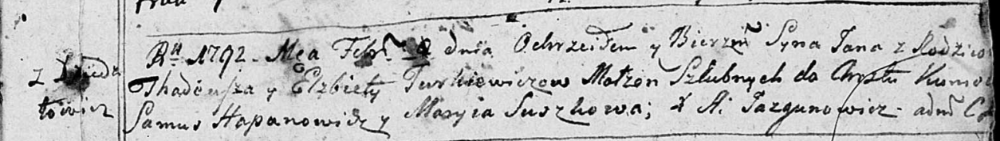

**Туркевич Ян Тадеев (Turkiewicz Jan)**

8 февраля 1792 г -- крещение (НИАБ 136-13-894, лист 15, №6/1792-р
(ориг)), (РГИА 823-2-18, лист 243об, №2/1792-р (коп)).

**НИАБ 136-13-894:** Лист 15. **Метрическая запись №6/1792-р (ориг).**

Дедиловичская Покровская церковь. 8 февраля 1792 года. Метрическая
запись о крещении.

Turkiewicz Jan -- дочь родителей с деревни Дедиловичи.

Turkiewicz Thadeusz -- отец.

Turkiewiczowa Elżbieta -- мать.

Hapanowicz Samuś -- кум.

Suszkowa Maryia - кума.

Jazgunowicz Antoni -- ксёндз.

**РГИА 823-2-18:** Лист 243об. **Метрическая запись №2/1792-р (коп).**

Дедиловичская Покровская церковь. 8 января 1792 года. Метрическая запись
о крещении.

Turkiewicz Jan -- сын родителей с деревни Дедиловичи.

Turkiewicz Tadeusz -- отец.

Turkiewiczowa Elżbieta -- мать.

Hapanowicz Samus -- кум.

Suszkowa Marya - кума.

Jazgunowicz Antoni -- ксёндз.
