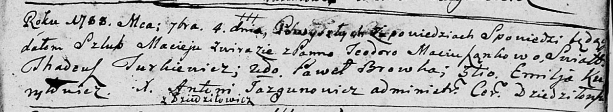

**Фираго Мацей (Zwiraha Maciey)**

4 сентября 1788 г -- венчание с Теодорой Мацюшёнок (НИАБ 136-13-894,
лист 67, №8/1788-б (ориг)).

**НИАБ 136-13-894:** Лист 67. **Метрическая запись №8/1788-б (ориг).**

{width="6.496527777777778in"
height="1.1928291776027997in"}

Дедиловичская Покровская церковь. 4 сентября 1788 года. Метрическая
запись о венчании.

Zwiraha Maciey -- жених, с деревни Дедиловичи.

Maciusząkowa Teodora -- невеста.

Turkiewicz Tadeusz -- свидетель.

Browka Paweł -- свидетель.

Kuryłowicz Emiljan -- свидетель.

Jazgunowicz Antoni -- ксёндз.
