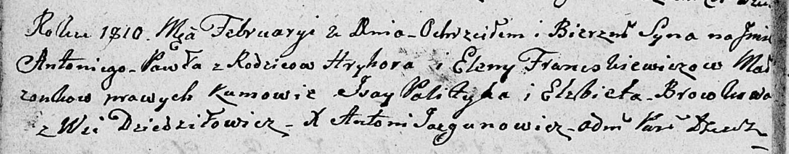

**Франчкевич Едена (Franczkiewiczowa Elena)**

2 февраля 1810 г -- крещение сына Антона Павла (НИАБ 136-13-894, лист
76об, №6/1810-р (ориг)).

**НИАБ 136-13-894:** Лист 76об. **Метрическая запись №6/1810-р (ориг).**

{width="6.496527777777778in"
height="1.2779833770778652in"}

Дедиловичская Покровская церковь. 2 февраля 1810 года. Метрическая
запись о крещении.

Franczkiewicz Antoni Paweł -- сын родителей из деревни Дедиловичи.

Franczkiewicz Hryhor -- отец.

Franczkiewiczowa Elena -- мать.

Palityka Jsay -- кум.

Browkowa Elżbieta -- кума.

Jazgunowicz Antoni -- ксёндз.
