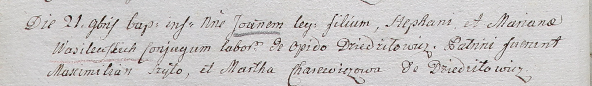

**Харевич Марта (Charewiczowa Martha)**

21 ноября 1802 г -- крестная мать Иоанна, сына Стефана и Марьяны
Василевских с деревни Дедиловичи (НИАБ 937-4-32, лист 7об, №39/1802-р).

**НИАБ 937-4-32:** Лист 7об. **Метрическая запись №39/1802-р.**

{width="6.496527777777778in"
height="0.9513888888888888in"}

Дедиловичский костел Наисвятейшего Сердца Иисуса. 21 ноября 1802 года.
Метрическая запись о крещении.

Wasilewski Joann -- сын крестьян с местечка Дедиловичи.

Wasilewski Stephan -- отец.

Wasilewska Mariana -- мать.

Szyło Maximilian -- крестный отец.

Charewiczowa Martha -- крестная мать, с деревни Дедиловичи.

Linhart Hyacinthus -- ксёндз.
