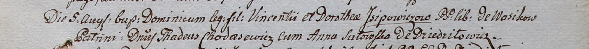

**Ходасевич Тадеуш (Chodasewicz Thadeusz)**

5 августа 1800 г -- крестный отец Доминика, сына Винцентия и Доротей
Исиповичей с деревни Васильковка (НИАБ 937-4-32, лист 2, №24/1800-р).

**НИАБ 937-4-32.** Лист 2. **Метрическая запись №24/1800-р.**

Дедиловичский костел Наисвятейшего Сердца Иисуса. 5 августа 1800 года.
Метрическая запись о крещении.

Jsjpowicz Dominic -- сын вольных людей с деревни Васильковка.

Jsjpowicz Vincenti -- отец.

Jsjpowiczowa Dorothea -- мать.

Chodasewicz Thadeusz -- крестный отец, шляхтич, с деревни Дедиловичи.

Sutowska Anna -- крестная мать, с деревни Дедиловичи.

Linhart Hyacinthus -- ксёндз.
