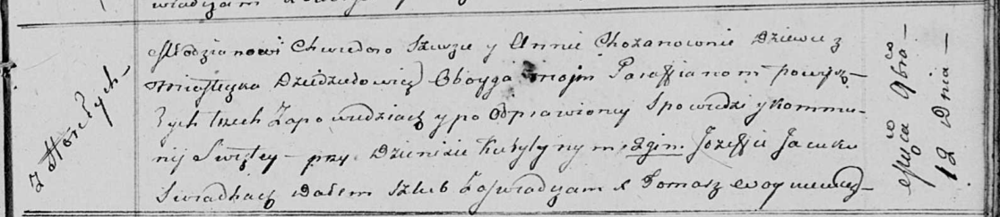

**Сушко (в девичестве Хозан) Анна (Suszkowa Anna z Chozanow)**

12 ноября 1811 г -- венчание с молодым Хведором Сушко с деревни Горелое
(НИАБ 136-13-920, лист 18, №11/1811-б (ориг)).

**НИАБ 136-13-920:** Лист 18. **Метрическая запись №11/1811-б (ориг).**

{width="6.496527777777778in"
height="1.414767060367454in"}

Осовская Покровская церковь. 12 ноября 1811 года. Метрическая запись о
венчании.

Szusza Chwiedor -- жених, молодой, парафии Осовской, с деревни Горелое.

Chozanowna Anna -- невеста, девка, парафии Осовской, местечко
Дедиловичи.

Kuryłyn Dzienis -- свидетель.

Jacuk Jozef -- свидетель.

Woyniewicz Tomasz -- ксёндз.
