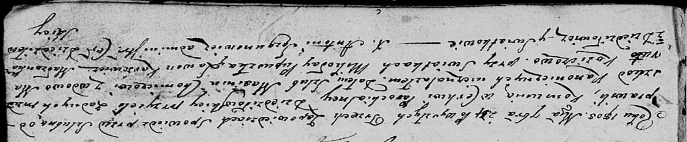

**Хомич Максим (Chomicz Maxim)**

24 сентября 1805 г -- венчание с вдовой Марутой Козич с деревни
Дедиловичи (НИАБ 136-13-920, лист 11, №2/1805-б (коп)).

**НИАБ 836-13-920:** Лист 11. **Метрическая запись №2/1805-б (ориг).**

Дедиловичская Покровская церковь. 24 сентября 1805 года. Метрическая
запись о венчании.

Chomichow Maxim -- жених, вдовец, с деревни Дедиловичи.

Koziczowa Maruta -- невеста, вдова, с деревни Дедиловичи.

Pupuszka Mikołay -- свидетель, с деревни Дедиловичи.

Karżewicz Lawon -- свидетель, с деревни Дедиловичи.

Jazgunowicz Antoni -- ксёндз.
