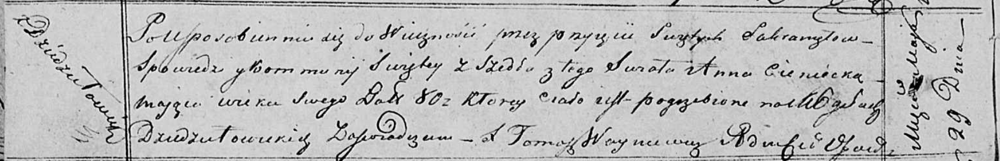

**Ценицкая Анна (Cieniecka Anna)**

29 мая 1820 г -- отпевание, умерла в возрасте 80 лет (родилась около
1740 г) (НИАБ 136-13-919, лист 33об, №13/1820-у (коп)).

**НИАБ 836-13-919:** Лист 33об. **Метрическая запись №13/1820-у
(ориг).**

Осовская униатская церковь. 29 мая 1820 года. Метрическая запись об
отпевании.

Cieniеcka Anna -- умершая, 80 лет, с деревни Дедиловичи, похоронена на
кладбище деревни Дедиловичи.

Woyniewicz Tomasz -- ксёндз.
