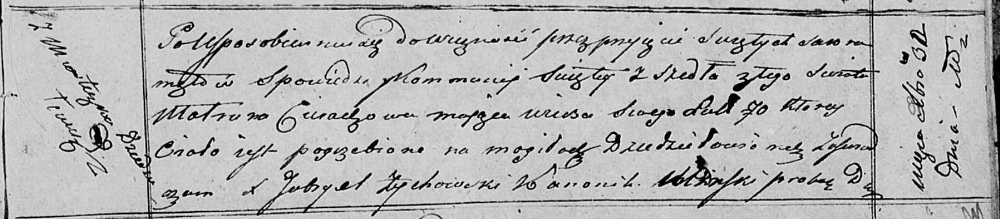

**Церах Матруна (Cierachowa Matruna)**

30 декабря 1820 г -- отпевание, умерла в возрасте 70 лет (родилась около
1740 г) (НИАБ 136-13-919, лист 34, №22/1820-у (коп)).

**НИАБ 836-13-919:** Лист 34. **Метрическая запись №22/1820-у (ориг).**

Осовская униатская церковь. 30 декабря 1820 года. Метрическая запись об
отпевании.

Cierachowa Matruna -- умершая, 70 лет, с местечка Дедиловичи, похоронена
на кладбище деревни Дедиловичи.

Woyniewicz Tomasz -- ксёндз.
