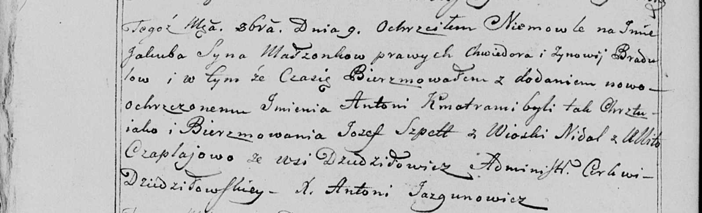

**Сушко (в предыдущем браке Чапляй) Феврония (Suszkowa (Czaplajowa)
Fewronija)**

4 мая 1813 г -- венчание с вдовцом Михалом Сушко с деревни Дедиловичи
(НИАБ 136-13-920, лист 19, №6/1813-б (ориг)).

**НИАБ 136-13-920:** Лист 19. **Метрическая запись №6/1813-б (ориг).**

{width="6.496527777777778in"
height="1.3014512248468941in"}

Осовская Покровская церковь. 4 мая 1813 года. Запись о венчании.

Suszko Michał -- жених, вдовец, парафии Осовской, с деревни Дедиловичи.

Czapłajowa Fewronia -- невеста, вдова, парафии Осовской, с деревни
Дедиловичи.

Kirko Mikołay -- свидетель.

Rapaсewicz Jozef -- свидетель.

Woyniewicz Tomasz -- ксёндз.
