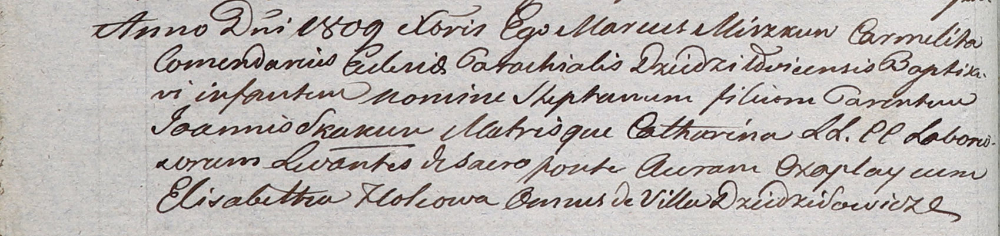

**Чапляй Аврам (Czaplay Awram)**

23 сентября 1800 г -- крестный отец Винцента Иосифа, сына Шпетов Сымона
и Прузызы с деревни Дедиловичи (НИАБ 136-13-949, лист 103об, №29/1800-р
(коп)).

2 марта 1802 г -- крестный отец Елены, дочери Яна и Катерины Скакунов с
деревни Дедиловичи (НИАБ 937-4-32, лист 6, №5/1802-р).

Декабрь 1809 г -- крестный отец Стефана, сына Яна и Катерины Скакунов с
деревни Дедиловичи (НИАБ 937-4-32, лист 20об, №33/1809-р).

**НИАБ 136-13-949:** Лист 103об. **Метрическая запись №29/1800-р
(коп).**

(См. тж.: НИАБ 136-13-894, лист 42, №26/1800-р (ориг))

{width="6.496527777777778in"
height="1.1006944444444444in"}

Дедиловичская Покровская церковь. 23 сентября 1800 года. Метрическая
запись о крещении.

Szpet Wincenty Jozef -- сын родителей с деревни Дедиловичи.

Szpet Symon -- отец.

Szpetowa Pruzyna -- мать.

Czaplay Awram -- кум, с деревни Дедиловичи.

Kabizionkowa Fruzyna - кума, с деревни Дедиловичи.

Jazgunowicz Antoni -- ксёндз.

**НИАБ 937-4-32:** Лист 6. **Метрическая запись №5/1802-р.**

{width="6.496527777777778in"
height="0.8833333333333333in"}

Дедиловичский костел Наисвятейшего Сердца Иисуса. 2 марта 1802 года.
Метрическая запись о крещении.

Skakunowna Helena -- дочь крестьян с деревни Дедиловичи.

Skakun Joann -- отец.

Skakunowa Catharina -- мать.

Czaplay Abram -- крестный отец, крестьянин, с деревни Дедиловичи.

Holcowa Elisabetha -- крестная мать, с деревни Дедиловичи.

Linhart Hyacinthus -- ксёндз.

**НИАБ 937-4-32:** Лист 20об. **Метрическая запись №33/1809-р.**

{width="6.496527777777778in"
height="1.5368055555555555in"}

Дедиловичский костел Наисвятейшего Сердца Иисуса. Декабря 1809 года.
Метрическая запись о крещении.

Skakun Stephan -- сын крестьян с деревни Дедиловичи.

Skakun Joann -- отец.

Skakunowa Catharina -- мать.

Czaplay Auram -- крестный отец, с деревни Дедиловичи.

Holcowa Elisabetha -- крестная мать, с деревни Дедиловичи.

Miszkun Marcus -- ксёндз, комендант Дедиловичский.
