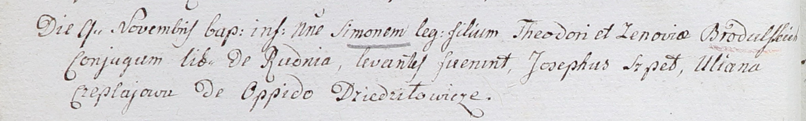

**Чапляй Ульяна (Czeplajowa Uliana)**

9 ноября 1802 г -- крестная мать Симона, дочери Тодора и Зеновии
Бродульских с деревни Рудня Лисинская Корсаковицкой волости (НИАБ
937-4-32, лист 7об, №33/1802-р).

**НИАБ 937-4-32:** Лист 7об. **Метрическая запись №33/1802-р.**

Дедиловичский костел Наисвятейшего Сердца Иисуса. 9 ноября 1802 года.
Метрическая запись о крещении.

Brodulski Simon -- сын вольных людей с деревни Рудня.

Brodulski Theodor -- отец.

Brodulska Zenovia -- мать.

Szped Joseph -- крестный отец.

Czeplajova Uliana -- крестная мать, с местечка Дедиловичи.

Linhart Hyacinthus -- ксёндз.
