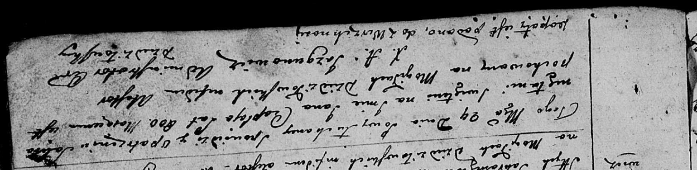

**Чапляй Ян (Czaplay Jan)**

29 сентября 1799 г -- отпевание, умер в возрасте 100 лет (родился около
1699 г) (НИАБ 136-13-919, лист 9, №18/1799-у (коп)).

**НИАБ 136-13-919:** Лист 9. **Метрическая запись №18/1799-у (ориг).**

Дедиловичская Покровская церковь. 29 сентября 1799 года. Метрическая
запись об отпевании.

Czaplaj Jan -- умерший, 100 лет, похоронен на кладбище деревни
Дедиловичи.

Jazgunowicz Antoni -- ксёндз.
