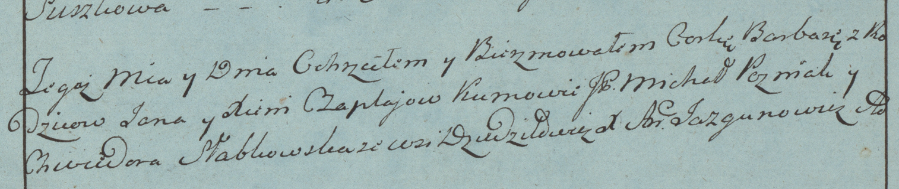

**Чапляй Ян (Czaplay Jan)**

15 декабря 1782г -- крещение дочери Варвары (РГИА 823-2-18, лист 223,
№16/1782-р (коп)).

**РГИА 823-2-18:** Лист 223. **Метрическая запись №16/1782-р (коп).**

Дедиловичская Покровская церковь. 15 декабря 1782 года. Метрическая
запись о крещении.

Czaplajowna Barbara -- дочь родителей с деревни Дедиловичи.

Czaplay Jan -- отец.

Czaplajowa Xienia -- мать.

Pozniak Michał, JP -- кум, шляхтич.

Słabkowska Chwiedora - кума.

Jazgunowicz Antoni -- ксёндз.
