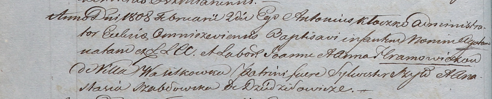

**Шабловская Анастасия (Szabłowska Anastasia)**

2 февраля 1808 г -- крестная мать Агаты, дочери Яна и Анны Хромовичей с
деревни Васильковка (НИАБ 937-4-32, лист 17об, №4/1808-р).

**НИАБ 937-4-32:** Лист 17об. **Метрическая запись №4/1808-р.**

{width="6.496527777777778in"
height="1.3145833333333334in"}

Дедиловичский костел Наисвятейшего Сердца Иисуса. 2 февраля 1808 года.
Метрическая запись о крещении.

Hramowiczowna Agata -- дочь крестьян с деревни Васильковка.

Hramowicz Joann -- отец.

Hramowiczowa Anna -- мать.

Szyło Silwester -- крестный отец.

Szabłowska Anastasia -- крестная мать, с деревни Дедиловичи.

Kłoczko Antonius -- ксёндз, администратор Омнишевский.
