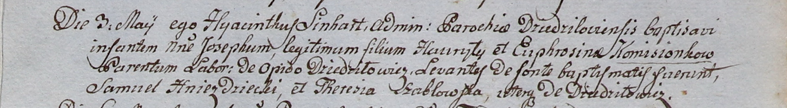

**Шабловская Тереза (Szabłowska Theresia)**

3 мая 1800 г -- крестная мать Иосифа, сына Гаврылы и Фрузыны Камизёнков
с деревни Дедиловичи (НИАБ 937-4-32, лист 2, №13/1800-р).

**НИАБ 937-4-32:** Лист 2. **Метрическая запись №13/1800-р.**

{width="6.496527777777778in"
height="0.9020833333333333in"}

Дедиловичский костел Наисвятейшего Сердца Иисуса. 3 мая 1800 года.
Метрическая запись о крещении.

Komisionek Joseph -- сын крестьян с деревни Дедиловичи.

Komisionek Hauryło -- отец.

Komisionkowa Euphrosina -- мать.

Hniezdzicki Samuel -- крестный отец, с деревни Дедиловичи.

Szabłowska Theresia -- крестная мать, с деревни Дедиловичи.

Linhart Hyacinthus -- ксёндз.
