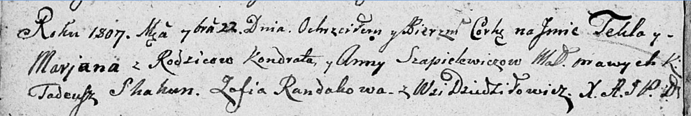

**Шапелевич Кондрат (Szapielewicz Kondrat)**

10 ноября 1801 г -- венчание с Анной Шарантовой с деревни Домашковичи
(НИАБ 136-13-920, лист 7об, №6/1801-б (ориг)).

22 сентября 1807 г -- крещение дочери Текли Марьяны (НИАБ 136-13-894,
лист 63об, №39/1807-р (ориг)).

**НИАБ 136-13-920:** Лист 7об. **Метрическая запись №6/1801-б (ориг).**

{width="6.496527777777778in"
height="1.2504932195975502in"}

Дедиловичская Покровская церковь. 10 ноября 1801 года. Метрическая
запись о венчании.

Szapielewicz Kondrat -- жених, с деревни \[Дедиловичи\].

Szarzantowna Anna -- невеста, с деревни Домашковичи.

Szyła Jgnacy -- свидетель.

Szapielewicz Chwiedor -- свидетель.

Jazgunowicz Antoni -- ксёндз.

**НИАБ 136-13-894:** Лист 63об. **Метрическая запись №39/1807-р
(ориг).**

{width="6.496527777777778in"
height="1.1023108048993875in"}

Дедиловичская Покровская церковь. 22 сентября 1807 года. Метрическая
запись о крещении.

Szapielewiczowna Tekla Marjana -- дочь родителей с деревни Дедиловичи.

Szapielewicz Kondrat -- отец.

Szapielewiczowa Anna -- мать.

Skakun Tadeusz -- кум.

Randakowa Zofia -- кума.

Jazgunowicz Antoni -- ксёндз.
