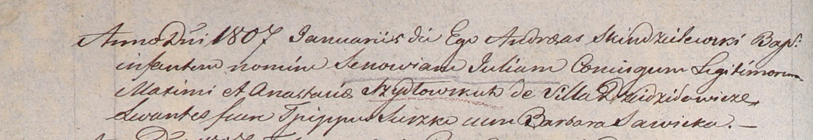

**Шидловская Анастасия (Szydłowska Anastasia)**

января 1807 г -- крещение дочери Зеновии Юлии (НИАБ 937-4-32, лист 14об,
№3/1807-р).

**НИАБ 937-4-32:** Лист 14об. **Метрическая запись №3/1807-р.**

{width="6.496527777777778in"
height="1.1298611111111112in"}

Дедиловичский костел Наисвятейшего Сердца Иисуса. января 1807 года.
Метрическая запись о крещении.

Szydłowska Zenowia Julia -- дочь родителей с деревни Дедиловичи.

Szydłowski Maxim -- отец.

Szydłowska Anastasia -- мать.

Suszko Tpippus? -- крестный отец.

Sawicka Barbara -- крестная мать.

Skindzelewski Andreas -- ксёндз, викарий Дедиловичский.
