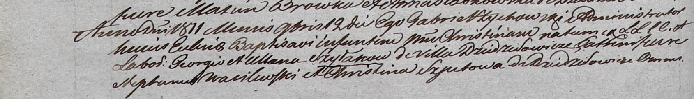

**Шилак Христина Георгиева (Szyłakowna Christina)**

12 ноября 1811 г -- крещение (НИАБ 937-4-32, лист 23об, №19/1811-р).

**НИАБ 937-4-32:** Лист 23об. **Метрическая запись №19/1811-р.**

{width="6.496527777777778in"
height="0.9347222222222222in"}

Дедиловичский костел Наисвятейшего Сердца Иисуса. 12 ноября 1811 года.
Метрическая запись о крещении.

Szyłakowna Christina -- дочь крестьян с деревни Дедиловичи.

Szyłak Georgio -- отец.

Szyłakowa Ullana -- мать.

Wasilewski Stephanus -- крестный отец.

Szpetowa Christina -- крестная мать, с деревни Дедиловичи.

Zychowski Gabriel -- ксёндз.
