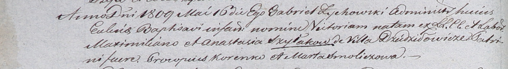

**Шилак Виктория Максимилианова (Szyłakowna Victoria)**

16 мая 1809 г -- крещение (НИАБ 937-4-32, лист 19об, №11/1809-р).

**НИАБ 937-4-32:** Лист 19об. **Метрическая запись №11/1809-р.**

Дедиловичский костел Наисвятейшего Сердца Иисуса. 16 мая 1809 года.
Метрическая запись о крещении.

Szyłakowna Victoria -- дочь крестьян с деревни Дедиловичи.

Szyłak Maximilian -- отец.

Szyłakowa Anastasia -- мать.

Korenko Procopus -- крестный отец.

Smoliczowa Marta -- крестная мать.

Zychowski Gabriel -- ксёндз.
