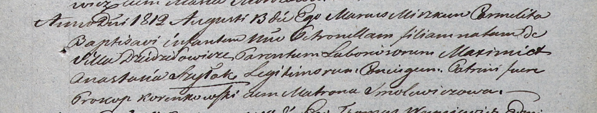

**Шилак Петронеля Максимилианова (Szyłakowna Petronilla)**

13 августа 1812 г -- крещение (НИАБ 937-4-32, лист 25, №21/1812-р).

**НИАБ 937-4-32:** Лист 25. **Метрическая запись №21/1812-р.**

{width="6.496527777777778in"
height="1.2361111111111112in"}

Дедиловичский костел Наисвятейшего Сердца Иисуса. 13 августа 1812 года.
Метрическая запись о крещении.

Szyłakowna Petronilla -- дочь крестьян с деревни Дедиловичи.

Szyłak Maxim -- отец.

Szyłakowa Anastasia -- мать.

Korenkowski Prokop -- крестный отец.

Smolewiczowna Matrona -- крестная мать.

Miszkun Marcus -- ксёндз.
