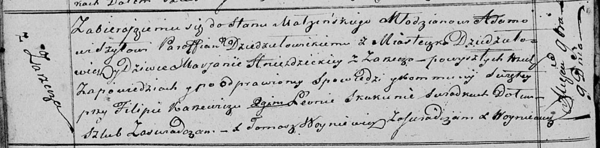

**Шило (в девичестве Гнездицкая) Марьяна (Szyłowa Marjana z
Hniezdzickich)**

9 ноября 1819 г -- венчание с молодым Адамом Шило с деревни Дедиловичи
(НИАБ 136-13-920, лист 26об, №12/1819-б (ориг)).

**НИАБ 136-13-920:** Лист 26об. **Метрическая запись №12/1819-б
(ориг).**

{width="6.496527777777778in"
height="1.6051902887139107in"}

Осовская Покровская церковь. 9 ноября 1819 года. Запись о венчании.

Szyło Adam -- жених, молодой, парафии Дедиловичской католической,
местечко Дедиловичи.

Hniezdzicka Marjana -- невеста, девка, с деревни Заречье.

Karżewicz Filip -- свидетель.

Skakun Leon -- свидетель.

Woyniewicz Tomasz -- ксёндз.
