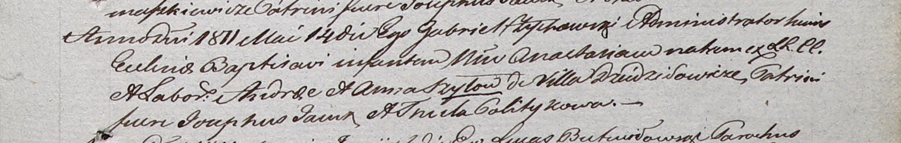

**Шило Анастасия Андреева (Szyłowna Anastasia)**

14 мая 1811 г -- крещение (НИАБ 937-4-32, лист 23, №8/1811-р).

**НИАБ 937-4-32:** Лист 23. **Метрическая запись №8/1811-р.**

Дедиловичский костел Наисвятейшего Сердца Иисуса. 14 мая 1811 года.
Метрическая запись о крещении.

Szyłowna Anastasia -- дочь крестьян с деревни Дедиловичи.

Szyło Andreas -- отец.

Szyłowa Anna -- мать.

Jacuk Joseph -- крестный отец.

Politykowa Thecla -- крестная мать.

Zychowski Gabriel -- ксёндз.
