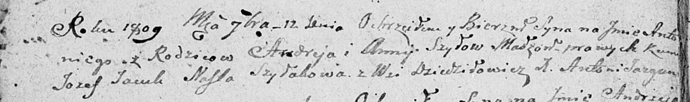

**Шило Антон Андреев (Szyło Antoni)**

12 сентября 1809 г -- крещение (НИАБ 136-13-894, лист 75об, №44/1809-р
(ориг)).

**НИАБ 136-13-894:** Лист 75об. **Метрическая запись №44/1809-р
(ориг).**

Дедиловичская Покровская церковь. 12 сентября 1809 года. Метрическая
запись о крещении.

Szyło Antoni -- сын родителей с деревни Дедиловичи.

Szyło Andrzey -- отец.

Szyłowa Anna -- мать.

Jacuk Jozef -- кум.

Szyłakowa Nasta -- кума.

Jazgunowicz Antoni -- ксёндз.
