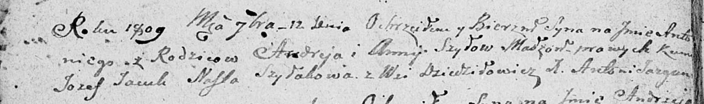

**Шило Пётр Андреев (Szyło Piotr)**

30 июня 1807 г -- крещение (НИАБ 136-13-894, лист 63, №32/1807-р
(ориг)).

**НИАБ 136-13-894:** Лист 63. **Метрическая запись №32/1807-р (ориг).**

{width="6.496527777777778in"
height="1.4637139107611548in"}

Дедиловичская Покровская церковь. 30 июня 1807 года. Метрическая запись
о крещении.

Szyło Piotr -- сын родителей с деревни Дедиловичи.

Szyło Andrzey -- отец.

Szyłowa Anna -- мать.

Jacuk Jozef -- кум.

Suszkowa Ahapa -- кума.

Jazgunowicz Antoni -- ксёндз.
