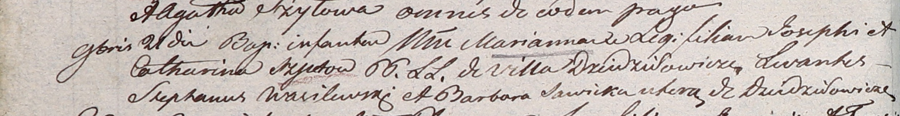

**Шило Иосиф (Szyło Joseph)**

21 ноября 1804 г -- крещение дочери Марьяны (НИАБ 937-4-32, лист 10об,
№23/1804-р).

**НИАБ 937-4-32:** Лист 10об. **Метрическая запись №23/1804-р.**

Дедиловичский костел Наисвятейшего Сердца Иисуса. 21 ноября 1804 года.
Метрическая запись о крещении.

Szyłowna Marianna -- дочь крестьян с деревни Дедиловичи.

Szyło Joseph -- отец.

Szyłowa Catharina -- мать.

Wasilewski Stephan -- крестный отец, с деревни Дедиловичи.

Sawicka Barbara -- крестная мать, с деревни Дедиловичи.

Galinowski Joann -- ксёндз, комендант Дедиловичского костела.
