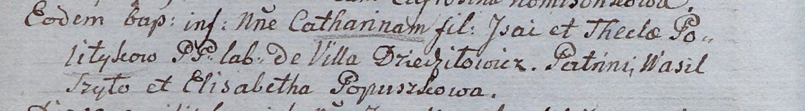

**Шило Катарина Исаева (Szyłowna Catharina)**

26 марта 1805 г -- крещение (НИАБ 937-4-32, лист 11об, №15/1805-р).

**НИАБ 937-4-32:** Лист 11об. **Метрическая запись №15/1805-р.**

Дедиловичский костел Наисвятейшего Сердца Иисуса. 26 марта 1805 года.
Метрическая запись о крещении.

Szyłowna Catharina -- дочь крестьян с деревни Дедиловичи.

Szyło Jsai -- отец.

Szyłowa Thecla -- мать.

Szyło Wasil -- крестный отец.

Popuszkowa Elisabetha -- крестная мать.

Linhart Hiacinthus -- ксёндз.
