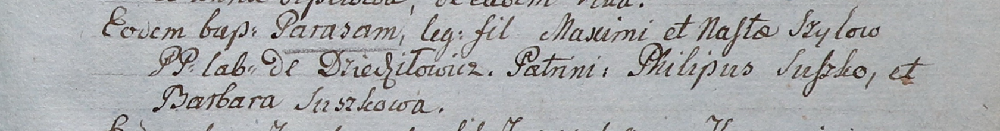

**Шило Наста (Szyłowa Nasta)**

3 сентября 1805 г -- крещение дочери Параси (НИАБ 937-4-32, лист 12,
№33/1805-р).

**НИАБ 937-4-32:** Лист 12. **Метрическая запись №33/1805-р.**

{width="6.496527777777778in"
height="0.8548611111111111in"}

Дедиловичский костел Наисвятейшего Сердца Иисуса. 3 сентября 1805 года.
Метрическая запись о крещении.

Szyłowna Parasia -- дочь крестьян с деревни Дедиловичи.

Szyło Maxim -- отец.

Szyłowa Nasta -- мать.

Suszko Philip -- крестный отец.

Suszkowa Barbara -- крестная мать.

Linhart Hiacinthus -- ксёндз.
